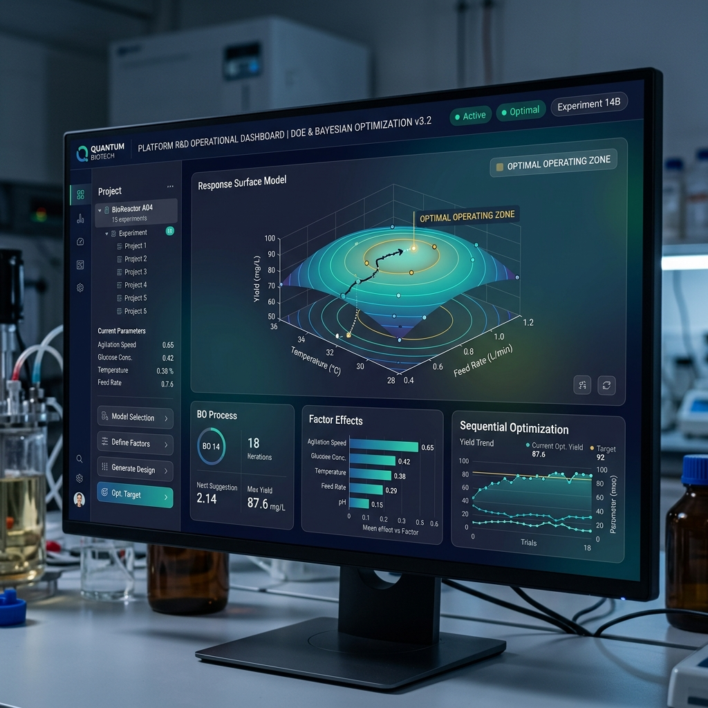

# OptimetricFlow DOE Engine 🚀

<!-- description: FlowSense DOE - An open-source Python library for industrial Design of Experiments (DOE), response surface analysis, and Bayesian optimization. -->

[](LICENSE)
[](https://www.python.org/)
[](https://optimetricflow.cn)

**FlowSense DOE** is a powerful Python package designed for industrial Design of Experiments (DOE), response surface analysis, and Bayesian next-experiment suggestion. It serves as the open-source analytical engine powering the [OptimetricFlow](https://optimetricflow.cn) platform.



## 🌟 Key Features

- **Classical DOE Generation**: Full/Fractional Factorial, Box-Behnken, and Central Composite Design (CCD).
- **Advanced Screening**: Plackett-Burman and Definitive Screening Design (DSD).
- **Mixture Designs**: Simplex Lattice, Simplex Centroid, and constrained mixtures.
- **Sequential Bayesian Optimization**: Intelligent next-experiment suggestions using Gaussian Processes.
- **Domain-Specific Presets**: Built-in factor templates tailored for bioprocess and chemical engineering workflows.

---

## 🎯 Target Audience & Use Cases

### Who is this for?
- **Process Engineers** optimizing lab and pilot-scale processes.
- **Bioprocess & Pharma Scientists** building Quality by Design (QbD) workflows.
- **Data Scientists** supporting industrial R&D experimental strategies.

### What can you build?
- Generate robust DOE matrices for screening or detailed response modeling.
- Fit regression models to accurately estimate factor effects and complex interactions.
- Utilize Bayesian optimization to minimize experimental runs while maximizing yield/quality.
- Standardize R&D data structures using predefined domain presets.

---

## 🚀 Quick Start

### 1. Installation

Install directly via `pip`:

```bash
pip install flowsense-doe
```

*(Note: If not yet available on PyPI, install from source by cloning this repository).*

### 2. Generate a Box-Behnken Design

```python
from flowsense_doe import DOEDesigner

designer = DOEDesigner()
factors = ["Temperature", "pH", "Stir_Rate"]
levels = [[30.0, 37.0], [6.0, 7.5], [200.0, 500.0]]

# Generate the design matrix with 3 center points
design_df = designer.box_behnken(factors, levels, center_points=3)
print(design_df.head())
```

### 3. Bayesian Optimization (Suggest Next Run)

```python
import numpy as np
from flowsense_doe import BayesianSuggester

factors_def = [
    {"name": "Temp", "min": 25.0, "max": 42.0},
    {"name": "pH", "min": 5.5, "max": 7.5},
]

suggester = BayesianSuggester(factors_def, objective="maximize")
X_obs = np.array([[30.0, 6.0], [37.0, 7.0]])
y_obs = np.array([12.5, 24.3])

# Get intelligent suggestion for the next experiment
next_point = suggester.suggest(X_obs, y_obs)
print("Suggested experiment:", next_point["suggestion"])
```

> **Tip:** See `examples/run_doe.py` for a complete end-to-end workflow demonstration.

---

## 🏛️ Ecosystem Integration

### Relationship to OptimetricFlow Platform

This repository contains the foundational **open-source DOE and optimization engine**. 
The full [OptimetricFlow Enterprise Platform](https://optimetricflow.cn) builds upon this to provide:
- Advanced workflow automation
- Interactive UI/UX for scientists
- Automated quality reporting
- Deployment-oriented analysis pipelines

### Limitations of the OSS Layer
- Not a full ELN/LIMS replacement.
- No built-in hardware integration for experiment execution.

---

## 🔗 Links & Citation

- **Official Website**: [optimetricflow.cn](https://optimetricflow.cn)
- **Citation**: If this project supports your research or process development, please cite it using the provided `CITATION.cff` file.

## 📄 License

This project is licensed under the MIT License - see the [LICENSE](LICENSE) file for details.

---

Built with ❤️ by the **OptimetricFlow Team**

