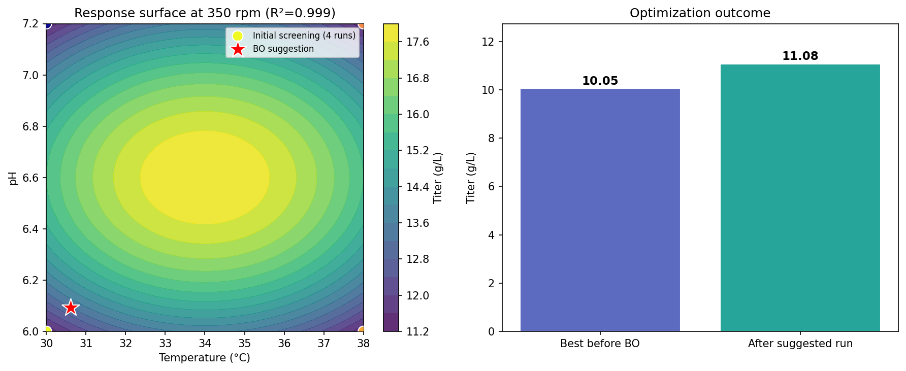

# OptimetricFlow DOE Engine 🚀

<!-- description: FlowSense DOE - An open-source Python library for industrial Design of Experiments (DOE), response surface analysis, and Bayesian optimization. -->

[](LICENSE)
[](https://www.python.org/)
[](https://optimetricflow.cn)

**FlowSense DOE** is a Python package for industrial Design of Experiments (DOE), response surface analysis, and Bayesian next-experiment suggestion.

It is also used in experimental and research workflows within the OptimetricFlow ecosystem.

---

## 📌 Maintenance Status

This project is maintained as a core research module of the OptimetricFlow ecosystem and receives updates when new DOE and optimization capabilities are developed.

---

## 🌟 Key Features

* **Classical DOE Generation**: Full/Fractional Factorial, Box-Behnken, and Central Composite Design (CCD).
* **Advanced Screening**: Plackett-Burman and Definitive Screening Design (DSD).
* **Mixture Designs**: Simplex Lattice, Simplex Centroid, and constrained mixtures.
* **Sequential Bayesian Optimization**: Intelligent next-experiment suggestions using Gaussian Processes.
* **Domain-Specific Presets**: Built-in factor templates tailored for bioprocess and chemical engineering workflows.

---

## 🎯 Target Audience & Use Cases

### Who is this for?

* Process engineers optimizing lab and pilot-scale processes
* Bioprocess & pharmaceutical scientists building Quality by Design (QbD) workflows
* Data scientists supporting industrial R&D experimental strategies

### What can you build?

* Robust DOE experimental designs for screening and optimization
* Response surface modeling for factor-effect estimation
* Bayesian optimization to reduce experimental cost
* Standardized experimental data pipelines for R&D workflows

---

## 🚀 Quick Start

### 1. Installation

Install from source:

```bash
git clone https://github.com/your-repo/flowsense-doe.git
cd flowsense-doe
pip install -e .
```

---

### 2. Generate a Box-Behnken Design

```python
from flowsense_doe import DOEDesigner

designer = DOEDesigner()
factors = ["Temperature", "pH", "Stir_Rate"]
levels = [[30.0, 37.0], [6.0, 7.5], [200.0, 500.0]]

design_df = designer.box_behnken(factors, levels, center_points=3)
print(design_df.head())
```

---

### 3. Bayesian Optimization (Suggest Next Experiment)

```python
import numpy as np
from flowsense_doe import BayesianSuggester

factors_def = [
    {"name": "Temp", "min": 25.0, "max": 42.0},
    {"name": "pH", "min": 5.5, "max": 7.5},
]

suggester = BayesianSuggester(factors_def, objective="maximize")

X_obs = np.array([[30.0, 6.0], [37.0, 7.0]])
y_obs = np.array([12.5, 24.3])

next_point = suggester.suggest(X_obs, y_obs)
print("Suggested experiment:", next_point["suggestion"])
```

> Tip: See `examples/run_doe.py` for a full end-to-end workflow.

---

## 📊 Real Usage Example

This example demonstrates a synthetic bioprocess optimization workflow:

* Temperature
* pH
* Stir rate
* → target output: antibody titer

The workflow uses DOE screening followed by Bayesian optimization.



### Run locally:

```bash
python examples/bioprocess_optimization.py
```

This will generate:

* `examples/data/synthetic_fermentation.csv`
* `assets/optimization_example.png`

---

## 🏛️ Ecosystem Integration

### Relationship to OptimetricFlow Platform

This repository provides the open-source DOE and optimization engine used in OptimetricFlow research workflows.

The OptimetricFlow platform builds on top of this library to provide:

* Workflow automation for experiments
* Interactive UI for scientists and engineers
* Automated reporting and analytics pipelines
* Deployment-ready decision support systems

### Scope of this Open Source Project

This library focuses on algorithmic and modeling components only.
It does not include:

* UI / dashboard systems
* Hardware integration layers
* Enterprise workflow orchestration

---

## 📦 Versioning

Current version: **v0.1.0 (early research release)**

---

## 🔗 Links & Citation

* Official Website: https://optimetricflow.cn
* Citation: Please refer to CITATION.cff for academic usage

---

## 📄 License

This project is licensed under the MIT License.

---

## 👤 Maintainer

Maintained by the OptimetricFlow project author.

---

Built with ❤️ for industrial experimentation and optimization workflows.
